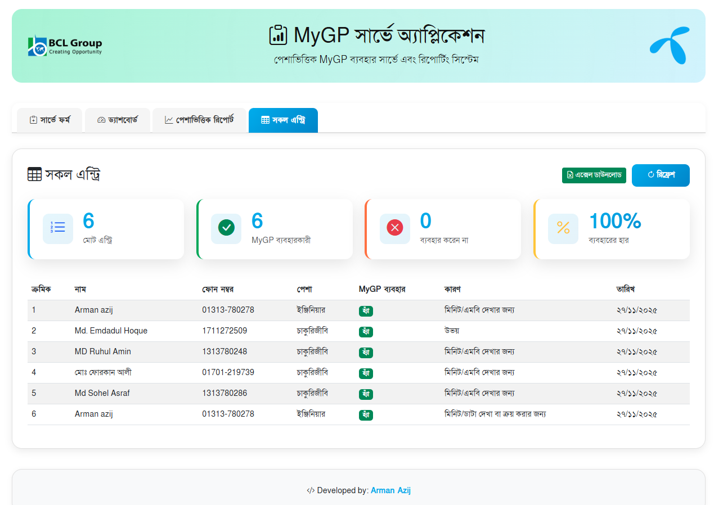
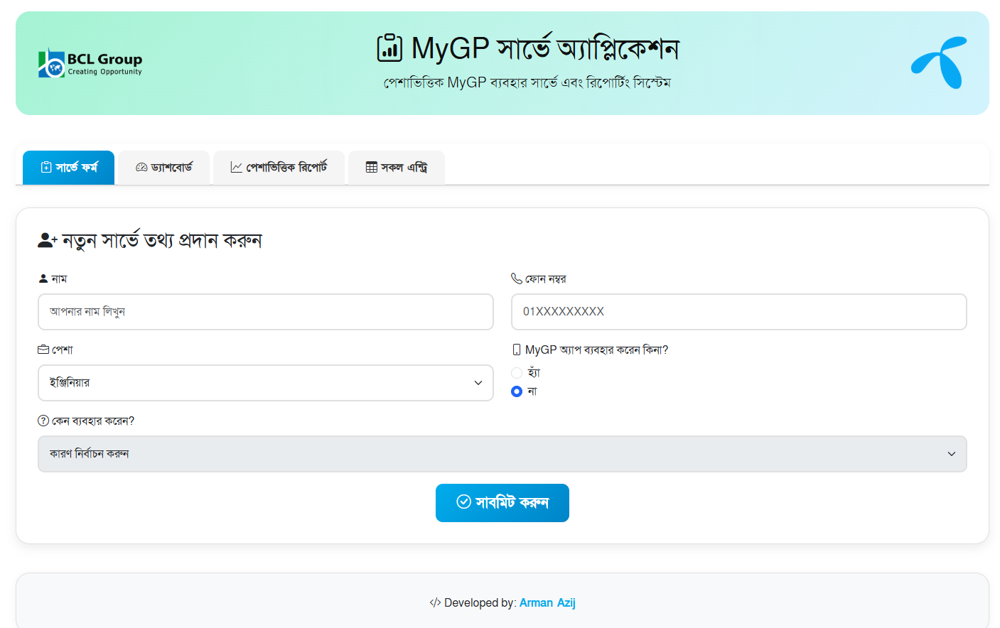
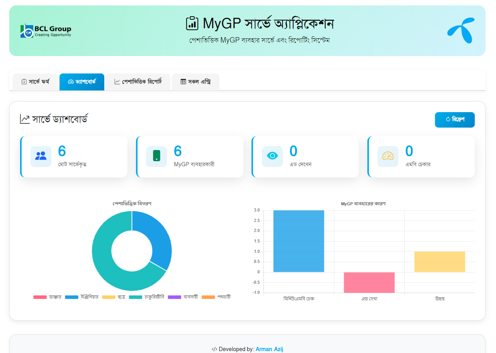
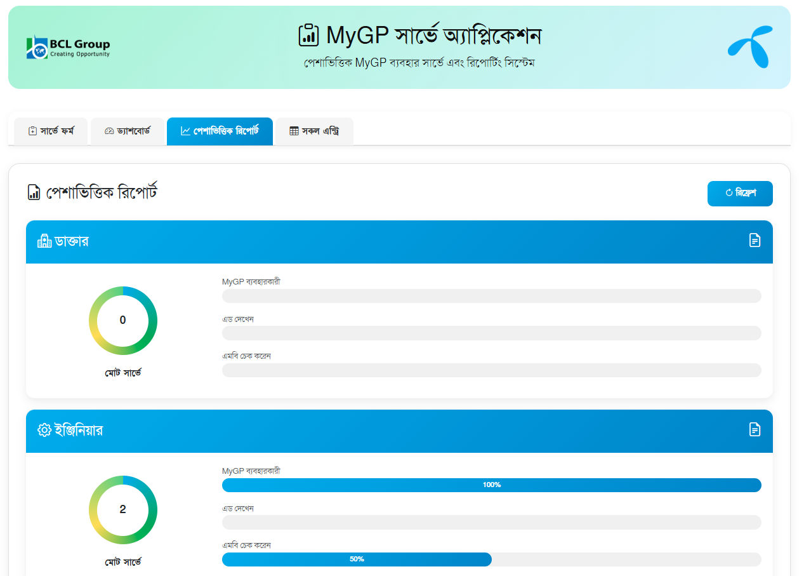

# 📊 MyGP Survey Application

A professional survey application for collecting and analyzing MyGP app usage data across different professions. Built with modern web technologies and integrated with Google Sheets for real-time data synchronization.

## ✨ Features

- 📱 **Real-time Data Sync** - Auto-refresh every 30 seconds
- 📊 **Interactive Dashboard** - Visual statistics with charts
- 👥 **Profession-based Reports** - Detailed analysis by profession
- 📥 **Excel Export** - Download complete reports
- 🎨 **Modern UI** - Beautiful design with Grameenphone colors
- 📱 **Mobile Responsive** - Works perfectly on all devices
- 🌐 **Bengali Language** - Full Solaiman Lipi font support
- 💾 **Offline Support** - Works without internet using localStorage

## 🚀 Technologies Used

- **Frontend**: HTML5, CSS3, JavaScript (ES6+)
- **UI Framework**: Bootstrap 5.3
- **Charts**: Chart.js
- **Excel Export**: SheetJS (xlsx)
- **Icons**: Bootstrap Icons
- **Backend**: Google Apps Script
- **Database**: Google Sheets
- **Font**: Solaiman Lipi (Bengali)

## 📸 Screenshots

<div align="center">

### Application Interface

<table>
  <tr>
    <td width="50%">
      
      <p align="center"><b>Survey Form & Dashboard</b></p>
    </td>
    <td width="50%">
      
      <p align="center"><b>Data Analytics</b></p>
    </td>
  </tr>
  <tr>
    <td width="50%">
      
      <p align="center"><b>Profession Reports</b></p>
    </td>
    <td width="50%">
      
      <p align="center"><b>All Entries View</b></p>
    </td>
  </tr>
</table>

</div>

## 📋 Setup Instructions

### Prerequisites

- Google Account
- Modern web browser
- Internet connection for initial setup

### Step 1: Google Spreadsheet Setup

1. Create a new Google Spreadsheet
2. Name the sheet: **"Sheet1"**
3. Add headers in the first row:

| A | B | C | D | E | F | G |
|---|---|---|---|---|---|---|
| ID | Name | Phone Number | Profession | Use MyGP | Reason | Timestamp |

### Step 2: Google Apps Script Deployment

1. Open your Google Spreadsheet
2. Go to **Extensions → Apps Script**
3. Delete any existing code
4. Copy all code from `app-script-code.txt`
5. Paste into the script editor
6. Click **Save** (Ctrl+S)
7. Click **Deploy → New deployment**
8. Settings:
   - Type: **Web app**
   - Execute as: **Me**
   - Who has access: **Anyone**
9. Click **Deploy**
10. Authorize the script when prompted
11. Copy the **Web App URL**

### Step 3: Application Configuration

1. Open `index.html`
2. Find line 915:
   ```javascript
   const GOOGLE_SCRIPT_URL = "YOUR_URL_HERE";
   ```
3. Replace with your copied Web App URL
4. Save the file

### Step 4: Launch Application

1. Open `index.html` in a web browser
2. The application will automatically load data from Google Sheets
3. Data refreshes every 30 seconds automatically

## 🎯 Usage

### Adding Survey Data

1. Navigate to **সার্ভে ফর্ম** (Survey Form) tab
2. Fill in the required information:
   - Name (নাম)
   - Phone Number (ফোন নম্বর)
   - Profession (পেশা)
   - MyGP Usage (MyGP ব্যবহার)
   - Reason (কারণ)
3. Click **সাবমিট করুন** (Submit)
4. Data will be saved to Google Sheets
5. Dashboard updates automatically

### Viewing Analytics

**Dashboard Tab (ড্যাশবোর্ড)**
- Total surveyed count
- MyGP users count
- Ad viewers count
- MB checkers count
- Interactive charts

**Profession Reports (পেশাভিত্তিক রিপোর্ট)**
- View statistics by profession
- Click any profession card for details
- Download individual profession reports

**All Entries (সকল এন্ট্রি)**
- View all survey entries
- Summary statistics cards
- Full data table
- Excel export functionality

### Exporting Data

1. Click the **এক্সেল ডাউনলোড** (Excel Download) button
2. Excel file downloads with all data
3. Includes proper Bengali text formatting
4. Opens in Excel, Google Sheets, or LibreOffice

## 📂 Project Structure

```
mygp-survey/
├── index.html              # Main application file
├── app-script-code.txt     # Google Apps Script code
├── README.md              # Project documentation
├── assets/
│   ├── bclgroup-lgoo.png  # BCL Group logo
│   └── Grameenphone_Logo.png  # Grameenphone logo
└── screenshots/           # Application screenshots
```

## 🔄 Auto-Refresh Feature

The application automatically refreshes data every 30 seconds:
- Runs in background (silent mode)
- No interruption to user
- Always shows latest data
- Manual refresh buttons available in all tabs

## 🎨 Design Highlights

- **Color Scheme**: Grameenphone blue (#00b0f0) and BCL green (#00a651)
- **Typography**: Solaiman Lipi for Bengali text
- **Icons**: Left-aligned in summary cards
- **Responsive**: Optimized for desktop, tablet, and mobile
- **User Experience**: Smooth animations and transitions

## 🛠️ Development

### Local Development

Simply open `index.html` in a browser. No build process required.

### Debugging

1. Open browser DevTools (F12)
2. Check Console for logs:
   ```
   === Loading data from Google Sheets ===
   ✓ Survey data loaded successfully!
   ```
3. View network requests for API calls

## 🐛 Troubleshooting

### Data not loading?

1. Check browser console (F12) for errors
2. Verify Google Apps Script URL is correct
3. Ensure Apps Script is deployed with "Anyone" access
4. Check Google Sheets "Sheet1" name is correct

### CORS errors?

- Apps Script URL must end with `/exec`
- Re-deploy the Apps Script
- Clear browser cache

### Data not updating?

- Wait 30 seconds for auto-refresh
- Click manual refresh button
- Check Apps Script execution logs

## 📊 Data Privacy

- Data stored in your Google Spreadsheet
- You have full control over the data
- No third-party storage
- Secure Google authentication

## 🤝 Credits

**Developed by:** Arman Azij  
**Link:** [https://fb.com/armanaazij](https://fb.com/armanaazij)

**For:** BCL Group  
**Client:** Grameenphone

## 📄 License

This project is developed for internal use by BCL Group for Grameenphone survey purposes.

## 🔗 Links

- **Repository**: [https://github.com/rejaulalomkhan/mygp-app-user-survey](https://github.com/rejaulalomkhan/mygp-app-user-survey)
- **Issues**: Report bugs or request features
- **Developer**: [Facebook Profile](https://fb.com/armanaazij)

## 📞 Support

For support or questions:
1. Check the console logs (F12)
2. Review Apps Script execution logs
3. Contact the developer

---

<div align="center">

**Made with ❤️ for BCL Group & Grameenphone**

⭐ Star this repo if you find it useful!

</div>
